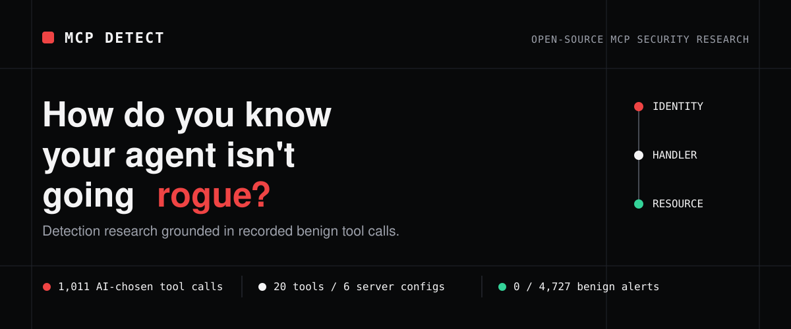

<p align="center">
  
</p>

<p align="center">
  <a href="https://github.com/RasheedFarhat/mcp-detect/actions/workflows/ci.yml"></a>
  <a href="https://github.com/RasheedFarhat/mcp-detect/releases/latest"></a>
  <a href="pyproject.toml"></a>
  <a href="LICENSE"></a>
</p>

<p align="center">
  <strong>To recognize abuse, start by observing legitimate tool use.</strong><br>
  MCP Detect recorded an AI agent choosing and calling MCP tools, froze that
  behavior as a labeled benign corpus, and tested every detection against what
  the agent actually did when nothing was wrong.
</p>

<p align="center">
  <a href="#60-second-reproduction">Reproduce</a> ·
  <a href="#start-with-normal">Method</a> ·
  <a href="#architecture-and-trust-boundary">Architecture</a> ·
  <a href="#measured-coverage">Coverage</a> ·
  <a href="#how-the-evidence-holds-together">Evidence</a> ·
  <a href="#honest-limitations">Limitations</a> ·
  <a href="#contributing-security-and-citation">Contributing</a>
</p>

> [!CAUTION]
> **MCP Detect is research software, not a production monitor or security
> guarantee.** Its included traffic is synthetic and self-authored. A clean run
> means only that these bounded checks found no matching indicators.

## 60-second reproduction

Python 3.11 or newer. No credentials, Docker, Wazuh installation, or private
files required.

```sh
git clone https://github.com/RasheedFarhat/mcp-detect.git
cd mcp-detect
make measure
```

The command checks the committed sample corpus against frozen Wazuh verdicts:

```text
# Offline reproduction -- tier: sample

Aggregate benign FP: 0/4727
...
PASSED -- reproduces the committed sample-level numbers
(data/attack_corpus_sample_v1.summary.md) from public files alone,
no Docker/Ollama/Wazuh needed.
```

Run the complete published corpus with:

```sh
make measure-full
```

The [reproduction note](REPRO-VERIFICATION.md) defines exactly what this proves
and what still requires a live engine.

## Why this exists

An MCP tool call compresses several trust decisions into one ordinary-looking
JSON-RPC exchange: which identity initiated it, which arguments crossed the
boundary, which handler accepted them, and which downstream resource was
reached.

MCP Detect makes the observable part of that path inspectable. A detection is
published with its threat model, signal, implementation, synthetic fixtures,
expected result, known misses, and reproduction path. The limitations ship
with the rule.

## Start with normal

**To catch an agent crossing a line, first learn how it uses the same tools
when the task is legitimate.**

MCP Detect gave a local `qwen3:1.7b` model benign tasks across filesystem,
Git, memory, time, and fetch servers. The model—not a scripted client—decided
which tools to call, which arguments to send, and when it had enough
information to stop. A transparent proxy recorded every JSON-RPC exchange and
labeled it with its session, task, and scenario.

```text
 benign task ──▶ local AI agent ──▶ autonomous MCP tool calls ──▶ result
                                           │
                                           ▼
                                    transparent proxy
                                           │
                                           ▼
                                frozen, labeled benign corpus
                                           │
                                  detections must stay quiet
```

The frozen v2 corpus contains **541 sessions, 1,011 model-chosen tool calls,
4,727 total records, and 20 distinct tools across six server configurations**.
It deliberately preserves the model's wrong paths, malformed calls, retries,
tool substitutions, and improvised workarounds. Those rough edges are useful:
they make the false-positive test resemble agent behavior rather than a tidy
set of invented happy paths.

The tasks and environment are synthetic; the tool choices and mistakes were
produced by the model. The published capture is immutable and checksummed
because a fresh LLM run can be behaviorally similar without being byte-for-byte
identical.

Read the [corpus summary](data/benign_corpus_v2.summary.md), inspect the
[agent loop](corpus/agent.py), or review the [task set](corpus/tasks.py).

## Architecture and trust boundary

```text
 authenticated identity
          │
          ▼
    MCP client ──JSON-RPC──▶ transparent proxy ──▶ MCP handler ──▶ resource
                                      │                   │
                                      │                   └─ authorization
                                      │                      must happen here
                                      ▼
                               telemetry.jsonl
                              ╱        │        ╲
                       Wazuh rules   stateful   evidence +
                                     drift     coverage tools
```

**Who can call it? What can it reach?**

The proxy forwards protocol bytes unchanged and records one JSONL event per
JSON-RPC message. That telemetry can show what identity and arguments reached a
handler. It cannot prove the handler enforced tenant ownership, object-level
authorization, or downstream access policy. That distinction is a boundary of
the architecture, not a rule still waiting to be written.

## Measured coverage

These are the results reproduced by `make measure-full` against the complete
committed corpus.

| Detection | Engine | Full-corpus result | Deliberate boundary |
|---|---|---:|---|
| [Tool poisoning](detections/SAF-T1001_tool_poisoning_html_comment/detection.yaml) | Wazuh, structural | **12/12** | Keyword-avoiding, non-comment, homoglyph, and padded instructions can evade |
| [Sensitive absolute-path read](detections/SAF-T1104_sensitive_abs_read/detection.yaml) | Wazuh, structural | **6/8** direct-rule matches | Renamed tools, unlisted paths, encoding, and symlink indirection remain outside the signal |
| [Path traversal](detections/SAF-T1105_path_traversal/detection.yaml) | Wazuh, structural | **6/8** direct-rule matches | The other two cases intentionally resolve to the credential-read rule; encoded and tool-name-spoofed traversal can evade |
| [Rug-pull drift](detections/SAF-T1201_rug_pull_baseline_drift/detection.yaml) | Stateful baseline → Wazuh | **3/3** drift shapes | Behavior-only changes are invisible; legitimate updates also require review |
| [Credential exfiltration](detections/SAF-T1502_credential_exfil/detection.yaml) | Wazuh, two-hop | **11/11** read + **11/11** exfil | Unknown argument keys, unlisted secret shapes, encoding, and renamed paths can evade individual hops |

The same replay reports **0 alerts across 4,727 project-authored benign
records**. These are regression results over synthetic traffic—not an
independent false-positive rate, field benchmark, or validated accuracy claim.

The detailed ledger, including untested and structurally invisible cases, lives
in [State of the Project](docs/STATE-OF-PROJECT.md).

## How the evidence holds together

MCP Detect does not ask you to trust a screenshot or a summary table.

```text
checksummed JSONL ──▶ frozen Wazuh verdicts ──▶ golden rule matches
          │                     │                        │
      exact input         pinned rule hash        expected metrics
          └─────────────────────┴────────────────────────┘
                        offline replay
```

- Corpus checksums identify the exact records being measured.
- Golden-match files preserve the final Wazuh rule ID captured for each line.
- Every golden file pins the SHA-256 of [`local_rules.xml`](wazuh/local_rules.xml).
- The replay refuses stale evidence when the current rules no longer match that
  hash.
- The optional live path recaptures verdicts from Wazuh and checks semantic
  parity with the frozen evidence.

Start with [Reproduction Verification](REPRO-VERIFICATION.md), then inspect the
[full corpus](data/full/attack_corpus_full_v1.summary.md) or the
[measurement implementation](framework/repro_offline.py).

## Where telemetry stops

> [!NOTE]
> **Synthetic reference—not customer work.** All tenants, invoices, code, and
> evidence in this example are fabricated for the repository.

The [cross-tenant authorization reference](samples/reference-mcp-review/README.md)
shows a valid-looking MCP invoice request that crosses a tenant boundary because
the handler trusts a caller-controlled `tenant_id`. Normal protocol telemetry
records a legitimate tool call; only the source and trust path reveal that the
authenticated tenant was ignored.

The reference includes the complete chain:

- [Intentionally vulnerable handler](samples/reference-mcp-review/vulnerable_server.py)
- [Exact source-level fix](samples/reference-mcp-review/fixed_server.py)
- [Denied cross-tenant retest](samples/reference-mcp-review/tests/test_authorization.py)
- [Checksummed evidence manifest](samples/reference-mcp-review/EVIDENCE-MANIFEST.json)

Run it independently:

```sh
python3 -m unittest discover \
  -s samples/reference-mcp-review/tests -p 'test_*.py' -v
```

## Choose the verification depth

| Path | Command | What it exercises |
|---|---|---|
| Fast offline replay | `make measure` | Public sample, frozen verdicts, published sample numbers |
| Full offline replay | `make measure-full` | Complete synthetic corpus and published full measurements |
| Offline release gate | `make verify` | Both corpus tiers, framework regressions, proxy, baseline, redaction, manifests, and authorization retest |
| Live engine parity | `make lab-up`, then follow [`docs/REPRO.md`](docs/REPRO.md) | Local Docker/Wazuh pipeline and recaptured engine verdicts |

The Docker stack uses development credentials and loopback assumptions. Do not
expose it to an untrusted network or treat it as a production deployment.

<details>
<summary><strong>Repository map</strong></summary>

| Path | Purpose |
|---|---|
| [`proxy/`](proxy/) | Byte-transparent MCP stdio proxy and telemetry capture |
| [`schema/`](schema/) | JSON Schema and validator for telemetry records |
| [`detections/`](detections/) · [`wazuh/`](wazuh/) | Detection definitions and Wazuh rules |
| [`baseline/`](baseline/) | Stateful trust-on-first-use drift detection |
| [`framework/`](framework/) | Compiler, registry, coverage, inventory, and verification tools |
| [`attacks/`](attacks/) · [`corpus/`](corpus/) | Synthetic traffic generators and fixtures |
| [`data/`](data/) | Sample, benign, evasion, and complete attack corpora |
| [`samples/reference-mcp-review/`](samples/reference-mcp-review/) | Synthetic authorization defect, exact fix, and denied retest |
| [`docs/`](docs/) | Design decisions, engine findings, reports, and research history |

</details>

## Honest limitations

- Every bundled malicious and benign record is synthetic and self-authored.
- Structural rules match observable shapes, not semantic intent.
- Encoded payloads, alternate field names, homoglyphs, renamed tools, and
  behavior-only compromise can cross the boundary without matching a rule.
- Trust-on-first-use drift detection needs analyst context to separate an
  approved change from a rug pull.
- Offline replay verifies committed calculations from frozen engine verdicts;
  it does not substitute for current live-engine parity.
- Handler authorization and downstream resource policy require source,
  configuration, identity, and denied-path testing beyond telemetry.

## Contributing, security, and citation

Contributions should make the evidence stronger, not merely increase a
coverage count. Read [CONTRIBUTING.md](CONTRIBUTING.md) before proposing a rule,
fixture, or framework change.

Report vulnerabilities privately through GitHub's
[security advisory flow](https://github.com/RasheedFarhat/mcp-detect/security/advisories/new),
following [SECURITY.md](SECURITY.md). For research use, citation metadata is in
[`CITATION.cff`](CITATION.cff). Release history is available in
[`CHANGELOG.md`](CHANGELOG.md) and on the
[releases page](https://github.com/RasheedFarhat/mcp-detect/releases).

MCP Detect was created and is maintained by
[Rasheed Farhat](https://github.com/RasheedFarhat).

## License

[MIT](LICENSE) © 2026 Rasheed Farhat. The license covers the original code,
schemas, rules, documentation, fixtures, and complete synthetic corpora in this
repository.
